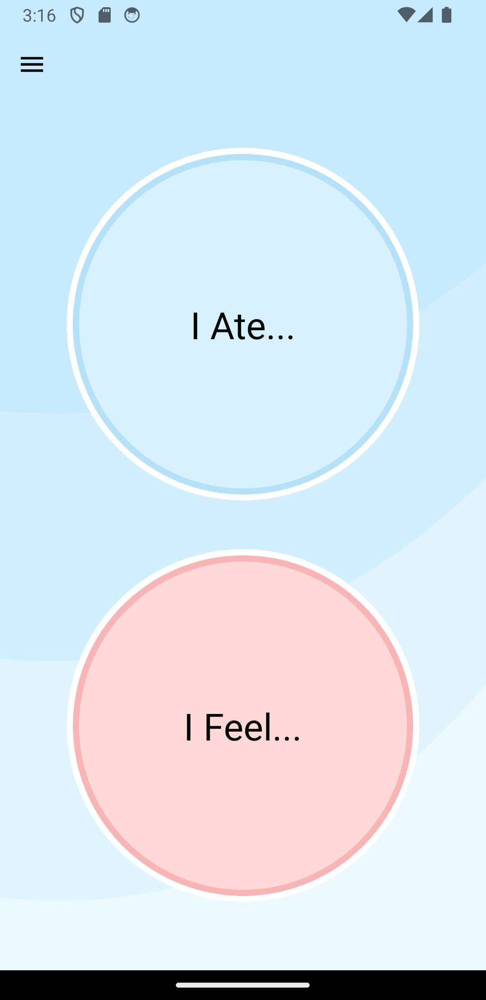
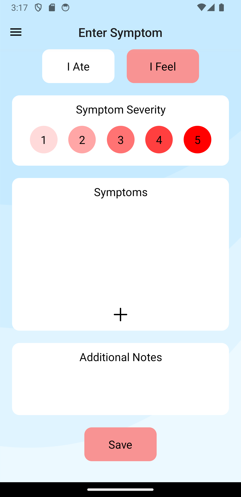
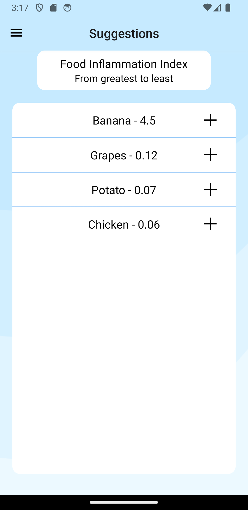
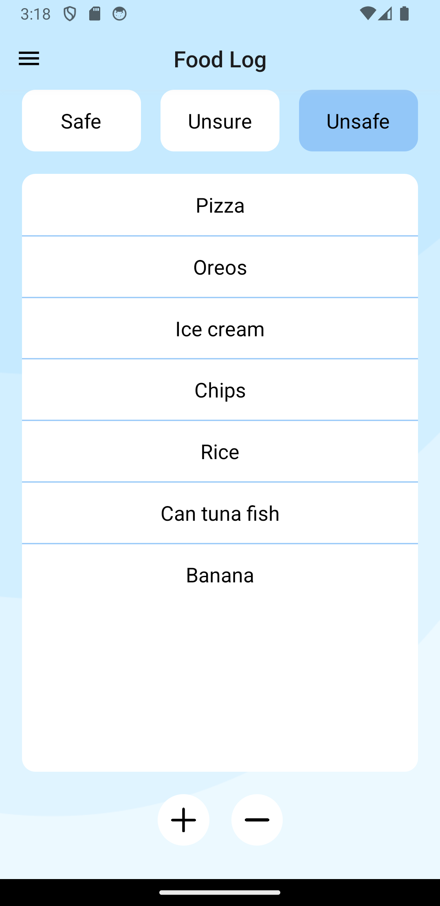

React Native mobile healthcare app that helps users track food intake and symptoms to identify potential inflammatory foods, particularly beneficial for individuals with Inflammatory Bowel Disease (IBD). Built using React Native with Expo, Express.js, and MongoDB.

The application follows a client-server architecture with a React Native frontend communicating with a REST API backend. The backend stores user data, food entries, symptom entries, and food logs in MongoDB, and integrates external APIs including Edamam API for food autocomplete and web scraping for symptom suggestions.

📊 **[View Pitch Deck](https://docs.google.com/presentation/d/15gmi2bHtHoJDx0nFUlM_0qDXJj3GZLIGKx2kRRpUmW0/edit?usp=sharing)**

**Pages:**
- `app/index.js`: Handles user login and registration with secure credential storage using Expo SecureStore.
- `app/home/index.js`: Main dashboard displaying navigation to app features ("I Ate..." and "I Feel..." buttons).
- `app/enter-food/index.js`: Food entry interface for logging meals with size ratings and additional notes.
- `app/enter-symptom/index.js`: Symptom entry interface for logging symptoms with severity ratings and additional notes.
- `app/food-log/index.js`: Food categorization interface for managing safe, unsure, and unsafe foods.
- `app/timeline/index.js`: Chronological timeline view displaying both food and symptom entries.
- `app/suggestions/index.js`: AI-powered analysis interface that calculates Food Inflammation Index to suggest potentially problematic foods based on correlation patterns.
- `app/about/index.js`: Information page about the app and its creator.

**API Routes:**
- `POST /users/add`: User registration endpoint.
- `POST /users/login`: User authentication endpoint.
- `POST /entries/food`: Create new food entry.
- `POST /entries/symptom`: Create new symptom entry.
- `POST /entries/`: Retrieve all food and symptom entries for a user.
- `POST /logs/`: Retrieve user's food logs.
- `POST /logs/post`: Add food to user's food log.
- `POST /logs/remove`: Remove food from user's food log.
- `POST /api/food`: Food autocomplete endpoint using Edamam API.
- `POST /api/symptom`: Symptom autocomplete endpoint using web-scraped symptom database.

  
  
  
  
  
  

